# Data Engineering Zoomcamp Cohort 2025

This repo contains all my materials, notes and homework for the [Data Engineering Zoomcamp](https://github.com/DataTalksClub/data-engineering-zoomcamp).


## Module 1: Docker, SQL, Terraform

### Learning in Public
I documented my learning in a [Medium article](https://medium.com/@angelaniederberger/e5282f6f9d1b).

### Homework

<details><summary><b>Question 1. Understanding docker first run</b></summary>

Run docker with the python:3.12.8 image in an interactive mode, use the entrypoint bash. What's the version of pip in the image?

<b>Answer:</b>

In bash: `docker run -it --entrypoint bash python:3.12.8` 
The image will run locally. To check the version of pip: `pip --version`. It is version `24.3.1`.
</details>

<details><summary><b>Question 2. Understanding Docker networking and docker-compose</b></summary>

Given the following docker-compose.yaml, what is the hostname and port that pgadmin should use to connect to the postgres database?

<b>Answer:</b>

The container name with the postgres database is `postgres`, located at port `5432`, so the answer is `postgres:5432`.
</details>

<details><summary><b>Question 3. Trip Segmentation Count</b></summary>

During the period of October 1st 2019 (inclusive) and November 1st 2019 (exclusive), how many trips, respectively, happened:

- Up to 1 mile
- In between 1 (exclusive) and 3 miles (inclusive),
- In between 3 (exclusive) and 7 miles (inclusive),
- In between 7 (exclusive) and 10 miles (inclusive),
- Over 10 miles

<b>Answer:</b>

Query:
```SQL
SELECT
	CASE
		WHEN TRIP_DISTANCE <= 1 THEN '1: <1'
		WHEN TRIP_DISTANCE > 1
		AND TRIP_DISTANCE <= 3 THEN '2: 1-3'
		WHEN TRIP_DISTANCE > 3
		AND TRIP_DISTANCE <= 7 THEN '3: 3-7'
		WHEN TRIP_DISTANCE > 7
		AND TRIP_DISTANCE <= 10 THEN '4: 7-10'
		WHEN TRIP_DISTANCE > 10 THEN '5: 10+'
		ELSE 'unknown'
	END AS TRIP_DISTANCE_GROUP,
	COUNT(*) AS TRIP_COUNT
FROM
	GREEN_TAXI_TRIPS
WHERE
	DATE_TRUNC('day', LPEP_DROPOFF_DATETIME) BETWEEN '2019-10-01' AND '2019-10-31'
GROUP BY
	TRIP_DISTANCE_GROUP;
```
Result:

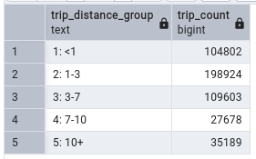
</details>

<details><summary><b>Question 4. Longest trip for each day</b></summary>

Which was the pick up day with the longest trip distance? Use the pick up time for your calculations.

Tip: For every day, we only care about one single trip with the longest distance.


<b>Answer:</b>

Query:
```SQL
SELECT
	DATE_TRUNC('day', LPEP_PICKUP_DATETIME) AS DATE,
	MAX(TRIP_DISTANCE) AS MAX_DISTANCE
FROM
	GREEN_TAXI_TRIPS
WHERE
	DATE_TRUNC('day', LPEP_PICKUP_DATETIME) BETWEEN '2019-10-01' AND '2019-10-31'
GROUP BY
	DATE_TRUNC('day', LPEP_PICKUP_DATETIME)
ORDER BY
	MAX_DISTANCE DESC
LIMIT
	1;
```

Result:

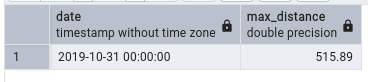
</details>

<details><summary><b>Question 5. Three biggest pickup zones</b></summary>

Which were the top pickup locations with over 13,000 in total_amount (across all trips) for 2019-10-18?

Consider only lpep_pickup_datetime when filtering by date.

<b>Answer:</b>

Query:
```SQL
SELECT
	ZONES."Zone",
	ROUND(CAST(TOTAL_AMOUNT_PER_ZONE AS NUMERIC), 2) AS TOTAL_AMOUNT_PER_ZONE
FROM
	(
		SELECT
			"PULocationID",
			SUM(TOTAL_AMOUNT) AS TOTAL_AMOUNT_PER_ZONE
		FROM
			GREEN_TAXI_TRIPS
		WHERE
			DATE_TRUNC('day', LPEP_PICKUP_DATETIME) = '2019-10-18'
		GROUP BY
			"PULocationID"
	) AS TOTAL_AMOUNT_AGG
	JOIN ZONES ON "PULocationID" = "LocationID"
WHERE
	TOTAL_AMOUNT_PER_ZONE > 13000;
```

Result:

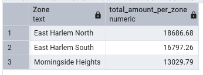
</details>

<details><summary><b>Question 6. Largest tip</b></summary>

For the passengers picked up in October 2019 in the zone name "East Harlem North" which was the drop off zone that had the largest tip?

Note: it's tip , not trip

We need the name of the zone, not the ID.

<b>Answer:</b>

Query:
```SQL
SELECT
	DZ."Zone" AS "DOZone",
	MAX(TRIPS.TIP_AMOUNT) AS MAX_TIP
FROM
	GREEN_TAXI_TRIPS AS TRIPS
	LEFT JOIN ZONES AS PZ ON TRIPS."PULocationID" = PZ."LocationID"
	LEFT JOIN ZONES AS DZ ON TRIPS."DOLocationID" = DZ."LocationID"
WHERE
	DATE_TRUNC('day', LPEP_PICKUP_DATETIME) BETWEEN '2019-10-01' AND '2019-10-31'
	AND PZ."Zone" = 'East Harlem North'
GROUP BY
	DZ."Zone"
ORDER BY
	MAX_TIP DESC
LIMIT
	1;
```

Result:

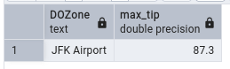
</details>

<details><summary><b>Question 7. Terraform Workflow</b></summary>

Which of the following sequences, respectively, describes the workflow for:

- Downloading the provider plugins and setting up backend,
- Generating proposed changes and auto-executing the plan
- Remove all resources managed by terraform`

<b>Answer:</b>

The required file is [here](./module_1/homework/main.tf).

The bash commands for the described workflow are the following:

```bash
$ terraform init
$ terraform apply -auto-approve
$ terraform destroy
```

</details>


## Module 2: Orchestration with Kestra

### Learning in Public
I documented my learning in this [Medium article](https://medium.com/@angelaniederberger/learning-in-public-orchestration-with-kestra-0ec485da063e).

### Homework

<details><summary><b>Question 1. File Size</b></summary>

Within the execution for `Yellow` Taxi data for the year `2020` and month `12`: what is the uncompressed file size (i.e. the output file `yellow_tripdata_2020-12.csv` of the extract task)?

<b>Answer:</b>

In the GCS Bucket I can see that the uncompressed file size for the specified file is 128.3 MB.

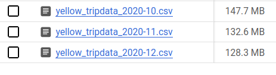

</details>

<details><summary><b>Question 2. Rendered Value</b></summary>

What is the rendered value of the variable `file` when the inputs `taxi` is set to `green`, `year` is set to `2020`, and `month` is set to `04` during execution?

<b>Answer:</b>

The variable `file` is defined as follows: `"{{inputs.taxi}}_tripdata_{{inputs.year}}-{{inputs.month}}.csv"`. When rendered with the specified inputs, this generates the value `green_tripdata_2020-04.csv`. This is also visible in the GCS Bucket: 

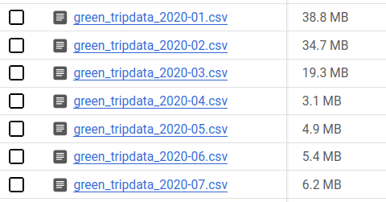

</details>

<details><summary><b>Question 3. Number of rows (yellow, 2020)</b></summary>

How many rows are there for the `Yellow` Taxi data for all CSV files in the year 2020?

<b>Answer:</b>

Query:
```SQL
SELECT
  COUNT(*) AS row_count
FROM
  `dez-2025.taxi_data.yellow_tripdata`
WHERE
  filename LIKE "%2020%";
```
Result:

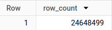
</details>

<details><summary><b>Question 4. Number of rows (green, 2020)</b></summary>

How many rows are there for the `Green` Taxi data for all CSV files in the year 2020?

<b>Answer:</b>

Query:
```SQL
SELECT
  COUNT(*) AS row_count
FROM
  `dez-2025.taxi_data.green_tripdata`
WHERE
  filename LIKE "%2020%";
```

Result:

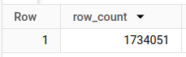
</details>

<details><summary><b>Question 5. Number of rows (yellow, March 2021)</b></summary>

How many rows are there for the `Yellow` Taxi data for the March 2021 CSV file?

<b>Answer:</b>

Query:
```SQL
SELECT
  COUNT(*) AS row_count
FROM
  `dez-2025.taxi_data.yellow_tripdata`
WHERE
  filename = "yellow_tripdata_2021-03.csv";
```

Result:

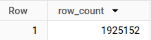

</details>

<details><summary><b>Question 6. Timezone for trigger</b></summary>

How would you configure the timezone to New York in a Schedule trigger?

<b>Answer:</b>

In the [Kestra Documentation on Schedule Triggers](https://kestra.io/docs/workflow-components/triggers/schedule-trigger) we can find the following information:

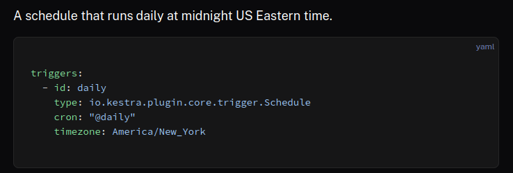
</details>


## Module 3: Data Warehouse

### Learning in Public
I documented my learning in this [Medium article](https://medium.com/@angelaniederberger/learning-in-public-data-warehouse-and-bigquery-58ceb162edd4).

### Homework

Queries used for setting up the tables:

External Table:
```SQL
CREATE OR REPLACE EXTERNAL TABLE
  `dez-2025.taxi_data.yellow_tripdata_2024_external` 
OPTIONS ( 
  format = 'PARQUET',
  uris = ['gs://taxi-data-files/yellow_tripdata_2024-*.parquet'] 
  );
```

Materialized Table:
```SQL
CREATE OR REPLACE TABLE
  `dez-2025.taxi_data.yellow_tripdata_2024` AS (
  SELECT
    *
  FROM
    `dez-2025.taxi_data.yellow_tripdata_2024_external`);
```

<details><summary><b>Question 1. Count of records for the 2024 Yellow Taxi Data</b></summary>

What is the count of records for the 2024 Yellow Taxi Data?

<b>Answer:</b>

Query:
```SQL
SELECT
  COUNT(*) AS row_count
FROM
  `dez-2025.taxi_data.yellow_tripdata_2024`;
```

Result:

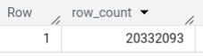
</details>

<details><summary><b>Question 2. Estimated amount of data</b></summary>

Write a query to count the distinct number of PULocationIDs for the entire dataset on both the tables.
What is the estimated amount of data that will be read when this query is executed on the External Table and the Table?

<b>Answer:</b>

Query:
```SQL
SELECT
  COUNT(DISTINCT PULocationID) AS pu_location_count
FROM
  `dez-2025.taxi_data.yellow_tripdata_2024`;
```

Result:

As shown in the screenshots below, BigQuery gives an accurate estimate for the materialized table (155 MB), but cannot generate an estimate for the data processed when querying the external table, because the data is not stored in BigQuery.

Materialized table:

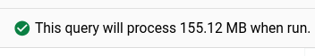

External table:

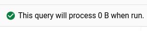

</details>

<details><summary><b>Question 3. Why are the estimated number of Bytes different?</b></summary>

Write a query to retrieve the PULocationID from the table (not the external table) in BigQuery. Now write a query to retrieve the PULocationID and DOLocationID on the same table. Why are the estimated number of Bytes different?

<b>Answer:</b>

Data storage in BigQuery is columnar (rather than row-oriented). This means that querying additional columns adds to the data volume. BigQuery only needs to retrieve the rows from those columns that are explicitly selected.

</details>

<details><summary><b>Question 4. How many records have a fare_amount of 0?</b></summary>

How many records have a fare_amount of 0?

<b>Answer:</b>

Query:
```SQL
SELECT
  COUNTIF(fare_amount = 0) AS trips_without_fare,
  COUNT(*) AS all_trips,
  COUNTIF(fare_amount = 0) / COUNT(*) * 100 AS perc_without_fare
FROM
  `dez-2025.taxi_data.yellow_tripdata_2024`;
```

Result:

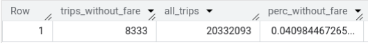
</details>

<details><summary><b>Question 5. The best strategy to make an optimized table in Big Query</b></summary>

What is the best strategy to make an optimized table in Big Query if your query will always filter based on tpep_dropoff_datetime and order the results by VendorID (Create a new table with this strategy)

<b>Answer:</b>

Partitioning can reduce the bytes processed when filtering on the partitioned column. Clustering orders the records by the selected column. Therefore, for the type of queries described, it would be most appropriate to partition by `tpep_dropoff_datetime` and cluster on the `VendorID`.

Query:
```SQL
CREATE OR REPLACE TABLE
  `dez-2025.taxi_data.yellow_tripdata_2024_partitioned_clustered`
PARTITION BY
  TIMESTAMP_TRUNC(tpep_dropoff_datetime, DAY)
CLUSTER BY
  VendorID AS (
  SELECT
    *
  FROM
    `dez-2025.taxi_data.yellow_tripdata_2024`);
```

</details>

<details><summary><b>Question 6. Estimated processed bytes</b></summary>

Write a query to retrieve the distinct VendorIDs between tpep_dropoff_datetime 2024-03-01 and 2024-03-15 (inclusive)

Use the materialized table you created earlier in your from clause and note the estimated bytes. Now change the table in the from clause to the partitioned table you created for question 5 and note the estimated bytes processed. What are these values? 

<b>Answer:</b>

Query:
```SQL
SELECT
  DISTINCT VendorID
FROM
  `dez-2025.taxi_data.yellow_tripdata_2024_partitioned_clustered`
WHERE
  tpep_dropoff_datetime BETWEEN '2024-03-01'
  AND '2024-03-15'; 
```

Result:

Without partitioning:

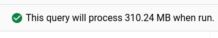

With partitioning:

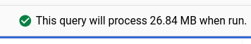

</details>

<details><summary><b>Question 7. Where is the data for external tables stored?</b></summary>

Where is the data stored in the External Table you created?

<b>Answer:</b>

The data is stored in the parquet files in the GCS Bucket. For external tables, BigQuery only provides the interface to explore the data.

</details>

<details><summary><b>Question 8. Always clustering</b></summary>

It is best practice in Big Query to always cluster your data.

<b>Answer:</b>

False.

Clustering can help improve especially filter and aggregate queries. Clusters are particularly helpful for columns with high cardinality (many distinct values). However, they also need to be maintained (via automatic re-clustering) and if the amount of data is small (< 1 GB) it is not advisable to cluster the table.

</details>

<details><summary><b>Question 9. Bytes read in SELECT COUNT(*)</b></summary>

Write a SELECT count(*) query FROM the materialized table you created. How many bytes does it estimate will be read? Why?

<b>Answer:</b>

The estimate is 0, because the result of this query was cached when I previously ran it for question 1.

Query:
```SQL
SELECT
  COUNT(*)
FROM
  `dez-2025.taxi_data.yellow_tripdata_2024` ;
```

Result:

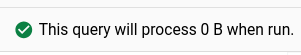

</details>

## Module 4: Analytics Engineering

### Learning in Public
I documented my learning in this [Medium article](https://medium.com/@angelaniederberger/learning-in-public-analytics-engineering-and-dbt-6e72358783ed).

### Homework

<details><summary><b>Question 1. Understanding dbt model resolution</b></summary>

Provided you've got the following sources.yaml

```
version: 2

sources:
  - name: raw_nyc_tripdata
    database: "{{ env_var('DBT_BIGQUERY_PROJECT', 'dtc_zoomcamp_2025') }}"
    schema:   "{{ env_var('DBT_BIGQUERY_SOURCE_DATASET', 'raw_nyc_tripdata') }}"
    tables:
      - name: ext_green_taxi
      - name: ext_yellow_taxi
```

with the following env variables setup where `dbt` runs:

```
export DBT_BIGQUERY_PROJECT=myproject
export DBT_BIGQUERY_DATASET=my_nyc_tripdata
```

What does this .sql model compile to?

```SQL
select * 
from {{ source('raw_nyc_tripdata', 'ext_green_taxi' ) }}
```


<b>Answer:</b>

Since the environment variables take precedence over the default value, the model would compile to:

```SQL
select *
from myproject.raw_nyc_tripdata.ext_green_taxi
```

</details>

<details><summary><b>Question 2. dbt Variables & Dynamic Models</b></summary>

Say you have to modify the following dbt_model (`fct_recent_taxi_trips.sql`) to enable Analytics Engineers to dynamically control the date range.

<ul>
    <li>In development, you want to process only the last 7 days of trips</li>
    <li>In production, you need to process the last 30 days for analytics</li>
</ul>

```SQL
select *
from {{ ref('fact_taxi_trips') }}
where pickup_datetime >= CURRENT_DATE - INTERVAL '30' DAY
```

What would you change to accomplish that in a such way that command line arguments takes precedence over ENV_VARs, which takes precedence over DEFAULT value?

<b>Answer:</b>
The variables would need to be nested inside the Jinja macro in the following way: `{{ CLI var("var", ENV var("VAR", default)) }}`. The correct answer is therefore:

Update the WHERE clause to `pickup_datetime >= CURRENT_DATE - INTERVAL '{{ var("days_back", env_var("DAYS_BACK", "30")) }}' DAY`.

</details>

<details><summary><b>Question 3. dbt Data Lineage and Execution</b></summary>

Considering the data lineage below and that `taxi_zone_lookup` is the only materialization build (from a .csv seed file):


Select the option that does NOT apply for materializing `fct_taxi_monthly_zone_revenue`.

<b>Answer:</b>
Out of the given options, only the one that specifies the staging folder would not apply for materializing `fct_taxi_monthly_zone_revenue`, because the table `dim_zone_lookup` would not get built, since it is not downstream from the models in the staging folder. The correct answer is therefore:

`dbt run --select models/staging/+`

</details>

<details><summary><b>Question 4. dbt Macros and Jinja</b></summary>

Consider you're dealing with sensitive data (e.g.: PII), that is <b>only available to your team and very selected few individuals</b>, in the `raw layer` of your DWH (e.g: a specific BigQuery dataset or PostgreSQL schema),

<ul>
    <li>Among other things, you decide to obfuscate/masquerade that data through your staging models, and make it available in a different schema (a <code>staging layer</code>) for other Data/Analytics Engineers to explore</li>
    <li>And <b>optionally</b>, yet another layer (<code>service layer</code>), where you'll build your dimension (<code>dim_</code>) and fact (<code>fct_</code>) tables (assuming the Star Schema dimensional modeling) for Dashboarding and for Tech Product Owners/Managers</li>
</ul>

You decide to make a macro to wrap a logic around it:

```SQL


    
    

     {{- env_var(target_env_var) -}}
                        {{- env_var(stging_env_var, env_var(target_env_var)) -}}
    


```

And use on your staging, dim_ and fact_ models as:

```
{{ config(
    schema=resolve_schema_for('core'), 
) }}
```

That all being said, regarding macro above, <b>select all statements that are true to the models using it</b>.

<b>Answer:</b>

Since there is no default set for the environment variable `target_env_var`, it needs to be defined in the environment, otherwise the macro won't work. If this variable is set, then it will be used for any model that is defined as `core` (in this case `staging`, `dim_` and `fact_` models). All other models will use the value from `stging_env_var` and if undefined, will fall back to `target_env_var`.

The following statements are therefore true:
<ul>
	<li>Setting a value for <code>DBT_BIGQUERY_TARGET_DATASET</code> env var is mandatory, or it'll fail to compile</li>
	<li>When using <code>core</code>, it materializes in the dataset defined in <code>DBT_BIGQUERY_TARGET_DATASET</code></li>
	<li>When using <code>stg</code>, it materializes in the dataset defined in <code>DBT_BIGQUERY_STAGING_DATASET</code>, or defaults to <code>DBT_BIGQUERY_TARGET_DATASET</code></li>
</ul>

</details>

<details><summary><b>Question 5. Taxi Quarterly Revenue Growth</b></summary>

<ol>
    <li>Create a new model <code>fct_taxi_trips_quarterly_revenue.sql</code></li>
    <li>Compute the Quarterly Revenues for each year for based on total_amount</li>
    <li>Compute the Quarterly YoY (Year-over-Year) revenue growth</li>
</ol>

<ul>
    <li>e.g.: In 2020/Q1, Green Taxi had -12.34% revenue growth compared to 2019/Q1</li>
    <li>e.g.: In 2020/Q4, Yellow Taxi had +34.56% revenue growth compared to 2019/Q4</li>
</ul>

Considering the YoY Growth in 2020, which were the yearly quarters with the best (or less worse) and worst results for green, and yellow

<b>Answer:</b>

The file with the new model for YoY Growth is [here](module_4/homework/models/core/fct_taxi_trips_quarterly_revenue.sql).

Query:
```SQL
SELECT
  *,
  (SAFE_DIVIDE(quarterly_revenue, prev_year_revenue)-1)*100 AS yoy_growth
FROM (
  SELECT
    year_quarter,
    service_type,
    SUM(total_amount) AS quarterly_revenue,
    LAG(SUM(total_amount), 4) OVER(PARTITION BY service_type ORDER BY year_quarter) AS prev_year_revenue,
  FROM
    `dez-2025.taxi_data_prod.fact_trips`
  WHERE
    year IN (2019,
      2020)
  GROUP BY
    service_type,
    year_quarter)
```

These are the best and worst results for green and yellow cabs:
<ul>
<li>green: {best: 2020/Q1, worst: 2020/Q2}, yellow: {best: 2020/Q1, worst: 2020/Q2}</li>
</ul>
</details>

<details><summary><b>Question 6. P97/P95/P90 Taxi Monthly Fare</b></summary>

<ol>
    <li>Create a new model <code>fct_taxi_trips_monthly_fare_p95.sql</code></li>
    <li>Filter out invalid entries (fare_amount > 0, trip_distance > 0, and payment_type_description in ('Cash', 'Credit Card'))</li>
    <li>Compute the <b>continous percentile</b> of <code>fare_amount</code> partitioning by service_type, year and and month</li>
</ol>

Now, what are the values of p97, p95, p90 for Green Taxi and Yellow Taxi, in April 2020?

<b>Answer:</b>

The file with the new model for the `fare_amount` percentiles is [here](module_4/homework/models/core/fct_taxi_trips_monthly_fare_p95.sql).

Query:
```SQL
WITH
  prep AS (
  SELECT
    service_type,
    year,
    month,
    PERCENTILE_CONT(fare_amount, 0.97) OVER(PARTITION BY service_type, year, month) AS p97,
    PERCENTILE_CONT(fare_amount, 0.95) OVER(PARTITION BY service_type, year, month) AS p95,
    PERCENTILE_CONT(fare_amount, 0.90) OVER(PARTITION BY service_type, year, month) AS p90
  FROM
    `dez-2025.taxi_data_prod.fact_trips`
  WHERE
    fare_amount > 0
    AND trip_distance > 0
    AND payment_type_description IN ('Cash',
      'Credit card'))
SELECT
  service_type,
  year,
  month,
  MAX(p97) AS P97,
  MAX(p95) AS P95,
  MAX(p90) AS P90,
FROM
  prep
WHERE
  year = 2020
  AND month = 4
GROUP BY
  service_type,
  year,
  month;
```

I'm getting the following output:
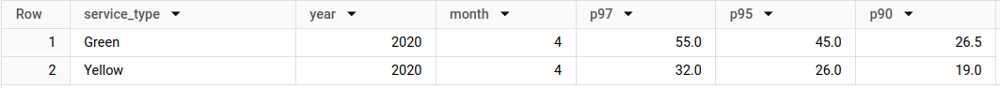

This is closest to this option from the homework assignment:
<ul>
<li>green: {p97: 55.0, p95: 45.0, p90: 26.5}, yellow: {p97: 31.5, p95: 25.5, p90: 19.0}</li>
</ul>
</details>

<details><summary><b>Question 7. Top #Nth longest P90 travel time Location for FHV</b></summary>

Prerequisites:

<ul>
    <li>Create a staging model for FHV Data (2019), and <b>DO NOT</b> add a deduplication step, just filter out the entries <code>where dispatching_base_num is not null</code></li>
    <li>Create a core model for FHV Data (<code>dim_fhv_trips.sql</code>) joining with <code>dim_zones</code>.</li>
    <li>Add some new dimensions <code>year</code> (e.g.: 2019) and <code>month</code> (e.g.: 1, 2, ..., 12), based on <code>pickup_datetime</code>, to the core model to facilitate filtering for your queries</li>
</ul>

Now...

<ol>
    <li>Create a new model <code>fct_fhv_monthly_zone_traveltime_p90.sql</code></li>
	<li>For each record in <code>dim_fhv_trips.sql</code>, compute the timestamp_diff in seconds between dropoff_datetime and pickup_datetime - we'll call it <code>trip_duration</code> for this exercise</li>
	<li>Compute the <b>continuous</b> <code>p90</code> of <code>trip_duration</code> partitioning by year, month, pickup_location_id, and dropoff_location_id</li>
</ol>

For the Trips that <b>respectively</b> started from <code>Newark Airport</code>, <code>SoHo</code>, and <code>Yorkville East</code>, in November 2019, what are <b>dropoff_zones</b> with the 2nd longest p90 trip_duration ?

<b>Answer:</b>

The file with the new model for the `P90` continuous percentiles is [here](module_4/homework/models/core/fct_fhv_monthly_zone_traveltime_p90.sql).

Query:
```SQL
SELECT
  *
FROM (
  SELECT
    *,
    ROW_NUMBER() OVER(PARTITION BY month, year, pickup_zone ORDER BY P90 DESC) AS row_number
  FROM
    `dez-2025.taxi_data_prod.fct_fhv_monthly_zone_traveltime_p90`
  WHERE
    year = 2019
    AND month = 11
    AND pickup_zone IN ("Newark Airport",
      "SoHo",
      "Yorkville East"))
WHERE
  row_number < 3;
```

I'm getting the following output:
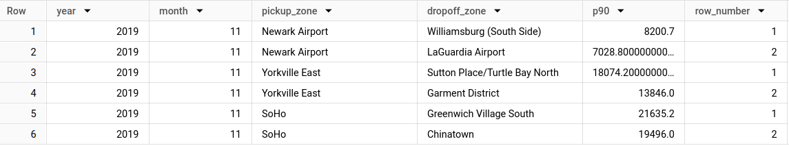

Therefore, the correct answer is:
<ul>
<li>LaGuardia Airport, Chinatown, Garment District</li>
</ul>
</details>

## Module 5: Batch Processing and Spark

### Learning in Public
I documented my learning in this [Medium article](https://medium.com/@angelaniederberger/learning-in-public-batch-processing-and-spark-ec7e48addf8a).

### Homework

The code related to all these questions is in this [notebook](./module_5/homework/250309_homework.ipynb).

<details><summary><b>Question 1. Install Spark and PySpark</b></summary>

- Install Spark
- Run PySpark
- Create a local spark session
- Execute spark.version

What's the output?

<b>Answer:</b>

The output is: `3.3.2`.

</details>

<details><summary><b>Question 2. Yellow October 2024</b></summary>

Read the October 2'24 Yellow Taxi Data into a Spark Dataframe. Repartition the Dataframe into 4 partitions and save it to parquet.

What is the average size of the Parquet (ending with .parquet extension) Files that were created (in MB)?

<b>Answer:</b>

All four files have a size of about 25.4 MB.

</details>

<details><summary><b>Question 3. Count records</b></summary>

How many taxi trips were there on the 15th of October? Consider only trips that started on the 15th of October.

<b>Answer:</b>

Query:
```SQL
SELECT 
    MIN(tpep_pickup_datetime) AS first_trip,
    MAX(tpep_pickup_datetime) AS last_trip,
    COUNT(*) trip_count
FROM 
    yellow_taxis_oct_24
WHERE
    date(tpep_pickup_datetime) == '2024-10-15'
```

Output:

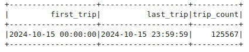

</details>

<details><summary><b>Question 4. Longest trip</b></summary>

What is the length of the longest trip in the dataset in hours?

<b>Answer:</b>

Query:
```SQL
SELECT
    MAX(trip_duration) as max_trip_duration
    FROM
        (SELECT
            TIMESTAMPDIFF(HOUR, tpep_pickup_datetime, tpep_dropoff_datetime) AS trip_duration
        FROM
            yellow_taxis_oct_24);
```

Output:

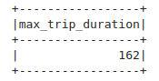

</details>

<details><summary><b>Question 5. User Interface</b></summary>

Spark’s User Interface which shows the application's dashboard runs on which local port?

<b>Answer:</b>

It runs on `localhost:4040`.

</details>

<details><summary><b>Question 6. Least frequent pickup location zone</b></summary>

Load the zone lookup data into a temp view in Spark:

```bash
wget https://d37ci6vzurychx.cloudfront.net/misc/taxi_zone_lookup.csv
```

Using the zone lookup data and the Yellow October 2024 data, what is the name of the LEAST frequent pickup location Zone?

<b>Answer:</b>

Query:
```SQL
SELECT
    Zone,
    COUNT(*) AS trip_count
    FROM
        yellow_taxis_zones_joined
    GROUP BY
        Zone
    ORDER BY
        trip_count
    LIMIT 5;
```

Output:

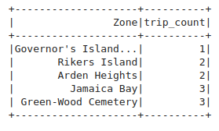

</details>


## Module 5: Streaming with Kafka and PyFlink

### Learning in Public
I'm documenting my learning in a Medium article (coming soon).

### Homework

<details><summary><b>Question 1. Redpanda version</b></summary>

Let's find out the version of redpandas. For that, check the output of the command `rpk help` inside the container. The name of the container is `redpanda-1`. Find out what you need to execute based on the `help` output.

What's the version, based on the output of the command you executed? (copy the entire version)

<b>Answer:</b>

When running `rpk --version` inside the redpandas docker container, I get the following output: `rpk version v24.2.18 (rev f9a22d4430)`.

</details>

<details><summary><b>Question 2. Creating a topic</b></summary>

Before we can send data to the redpanda server, we need to create a topic. We do it also with the `rpk` command we used previously for figuring out the version of redpandas. Read the output of `help` and based on it, create a topic with name `green-trips`.

What's the output of the command for creating a topic? Include the entire output in your answer.

<b>Answer:</b>

When I run `rpk topic create green-trips` I get the following output:


|TOPIC |STATUS|
|---|---|
|green-trips |OK|


</details>

<details><summary><b>Question 3. Connecting to the Kafka server</b></summary>

We need to make sure we can connect to the server, so later we can send some data to its topics

First, let's install the kafka connector (up to you if you want to have a separate virtual environment for that)

```bash
pip install kafka-python
```

You can start a jupyter notebook in your solution folder or create a script

Let's try to connect to our server:

```python
import json

from kafka import KafkaProducer

def json_serializer(data):
    return json.dumps(data).encode('utf-8')

server = 'localhost:9092'

producer = KafkaProducer(
    bootstrap_servers=[server],
    value_serializer=json_serializer
)

producer.bootstrap_connected()
```

Provided that you can connect to the server, what's the output of the last command?

<b>Answer:</b>

When I run this code in a Jupyter Notebook, I get the output `True`.

</details>

<details><summary><b>Question 4. Sending the Trip Data</b></summary>

Now we need to send the data to the green-trips topic. Read the data, and keep only these columns:
<ul>
    <li><code>'lpep_pickup_datetime'</code>,</li>
    <li><code>'lpep_dropoff_datetime'</code>,</li>
    <li><code>'PULocationID'</code>,</li>
    <li><code>'DOLocationID'</code>,</li>
    <li><code>'passenger_count'</code>,</li>
    <li><code>'trip_distance'</code>,</li>
    <li><code>'tip_amount'</code></li>
</ul>

Now send all the data using this code:

```python
producer.send(topic_name, value=message)
```

For each row (`message`) in the dataset. In this case, `message` is a dictionary.

After sending all the messages, flush the data:

```python
producer.flush()
```

Use `from time import time` to see the total time

```python
from time import time

t0 = time()

# ... your code

t1 = time()
took = t1 - t0
```

How much time did it take to send the entire dataset and flush?

<b>Answer:</b>


</details>

<details><summary><b>Question 5. Build a Sessionization Window</b></summary>

Now we have the data in the Kafka stream. It's time to process it.

<ul>
    <li>Copy <code>aggregation_job.py</code> and rename it to <code>session_job.py</code></li>
    <li>Have it read from <code>green-trips</code> fixing the schema</li>
    <li>Use a session window with a gap of 5 minutes</li>
    <li>Use <code>lpep_dropoff_datetime</code> time as your watermark with a 5 second tolerance</li>
</ul>

Which pickup and drop off locations have the longest unbroken streak of taxi trips?

<b>Answer:</b>


</details>
